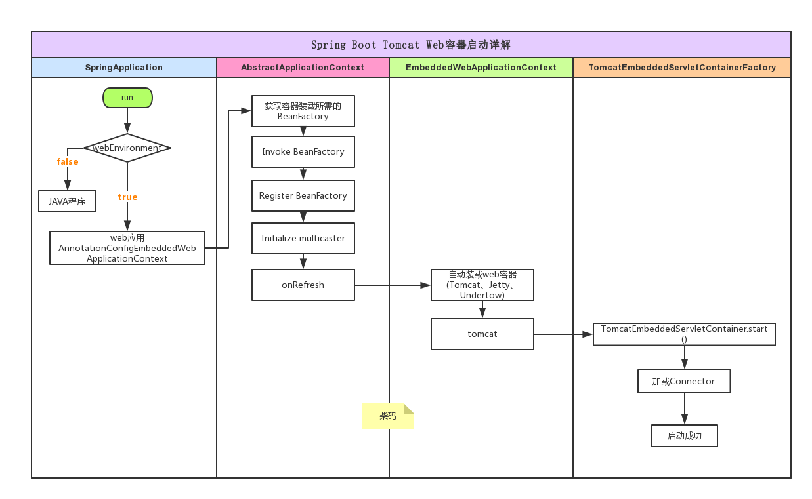
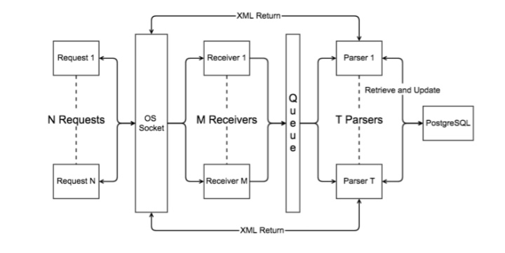
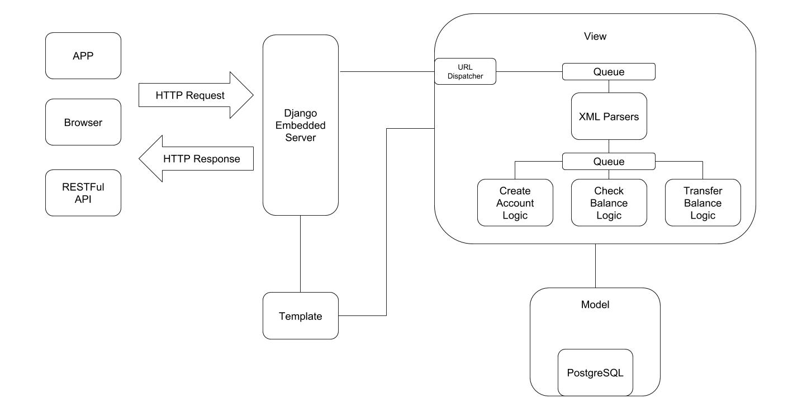

# Unified Vision Data Service
## Story 1 - Project Plan
### Target
This goal of this project is to provide a platform for vision data analytics as a service.
To provide analytical vision content that can drive innovation, vision data stored in different resources can be brought together to perform analysis.
### General Pipeline


### Framework Dependency
#### [Spring Boot](https://spring.io/guides/gs/spring-boot/)
  - Lightweight Java Web Framework
  - Easily solve IOC and AOP
  - Integration with well known patterns(Tomcat, Jackson, Hibernate, Log4j)
  - Alternative: Spring(complex configuration), Dropwizard

#### [Gradle](https://gradle.org/guides/)
  - Project Build and Management Framework
  - Alternative: Maven(worse script)

#### [MySQL 8.0](https://dev.mysql.com/doc/refman/8.0/en/tutorial.html)
  - RDBMS
  - Alternative: PostgreSQL

#### [Kafka](https://kafka.apache.org/intro)
  - Distributed Message Queue
  - Alternative: RabbitMQ

#### [Hadoop](http://hadoop.apache.org/docs/current/)
  - Distributed Big Data Processing Framework
  - Alternative: Spark

#### [HBase](http://hbase.apache.org/book.html#getting_started)
  - Distributed NoSQL Store

#### [Avro](http://avro.apache.org)
  - Data Serialization Framework
  - Compatible with Hadoop Eco
  - Alternative: protobuf

#### [Redis](https://redis.io)
  - In-Memory Distributed Key-Value Store
  - Best for Buffer

#### [Jenkins](https://jenkins.io)
  - Automate Build and Deployment Tool

#### [Docker](https://www.docker.com)
  - Web Application Virtualization Tool
  - Alternative: VM(heavy)

#### [Hibernate](http://hibernate.org)
  - ORM Framework
  - Mapping Relational Data into Object
  - Alternative: MyBatis

#### [Tomcat](http://tomcat.apache.org)
  - Servlet Container
  - Alternative: Jetty

#### [Jackson](https://github.com/FasterXML/jackson-docs)
  - Serialize POJOs to Json or XML

#### [Log4j](https://logging.apache.org/log4j/2.x/javadoc.html)
  - Logging Framework

## Story 2 - Hello World
### Description
This task is about using Gradle to initialize the whole project, configure dependencies: Spring Boot and deploy to Docker container.

### Instruction
#### Gradle Configuration
We initialize the whole project with type under our root directory `UVDS`:
```
gradle init
```
Then the basic Gradle configuration scripts and [Gradle Wrapper](https://docs.gradle.org/4.8/userguide/gradle_wrapper.html?_ga=2.128419721.428200427.1533059957-1761894786.1513880699) will be created. Gradle Wrapper is a stand-alone build program to make sure all users can share the same build environment. I recommend to use wrapper to execute any task like this under our root directory `UVDS`:
```
./gradlew [task name]
```
We introduce customized properties of this project such as description and version by using `gradle.properties` under `UVDS`.
```
touch gradle.properties
```
We put description and version into this file at first. So this file looks like:
```
description = "Unified Vision Data Service"
version = "0.0.0"
```
You can also put those properties into `build.gradle` but I prefer to group properties into a single file.

```
The difference between Gradle plugin, module dependecy and build classpath is:
1. Gradle plugin is Gradle preset task
2. module dependecy is the library compiled with your code
3. build classpath is needed for Gradle
```

We can see a lot Gradle script like this:
```Gradle
buildScript {
    repositories {
         mavenCentral()
    }
}

repositories {
     mavenCentral()
}
```
The buildScript block is for gradle script  itself and the other is for the project itself. For Spring Boot, with old Gradle, you have to put its plugin in both buildScript and apply() method. For new Gradle, just put plugins into plugins block.

For this project the build.gradle looks like this:
```Gradle
plugins {
  id 'java'
  id 'idea'
  id 'eclipse'
  id 'org.springframework.boot' version '2.0.3.RELEASE'
  id 'io.spring.dependency-management' version '1.0.6.RELEASE'
}

jar {
  baseName = 'UVDS'
  version = project.properties['version']
}

repositories {
  jcenter()
  mavenCentral()
}

dependencies {
  testImplementation 'junit:junit'
  implementation 'org.springframework.boot:spring-boot-starter-jersey'
}
```
The plugin ```io.spring.dependency-management``` is used to load the defined dependency.

The ```testImplementation```, ```Implementation``` is the replacement of the old ```compile``` and ```testCompile```.

The ```org.springframework.boot:spring-boot-starter-jersey``` is a predefined dependency aggregation for Jersey users This includes some most common modules when building a web application with Jersey. `org.springframework.boot:spring-boot-starter-test` is similar dependency but for test.

#### Spring Boot and Jersey Explanation
The minimum web application with Spring Boot and Jersey is composed of ```Application``` which is the start of the Spring Application, ```Service``` which defines the JAX-RS style RESTful API, ```JerseyConfig``` which is used to register the service class then Jersey framework will transform it into servlet, ```BeanConfig``` which is used to configure Bean registered in Spring Framework.

You may be interested in couple of questions:
* How Spring Boot framework find beans?
* Why JerseyConfig has to put as `@Component`?
* How Tomcat find the Servlet configured by Jersey?

After roughly reading the source code, the Spring Boot and Jersey frameworks will do couple of important things:
1. Initialize with `SpringApplication` constructor
* Set up `Initializers`
* Set up `Listener`
2. `SpringApplication.run` method
* Initialize `ConfigurableApplicationContext`(implements `ApplicationContext` which store all beans and rest)
* `prepareContext` prepare `Processor`, put running Application class(`HelloWorldApp.class`) into bean factory.
* `refreshContext`.`invokeBeanFactoryPostProcessors` search and register all beans(self defined[JerseyConfig], pre configured module[Jackson, Tomcat])
* `createWebServer` start build-in Tomcat(default)
* Configure port 8080(default)
* `startInternal` multiple engines like `LifecycleBase`, `StandardEngine`, `StandardService`, `StandardPipeline`, `ContainerBase` capture servlet in bean factory(?)(That is why JerseyConfig has to put `@Component` since embedded container will search servlets in context)


#### Spring Boot Test Framework
If we want to test our RestFul API, we can use real container(Integration Test) or we can use in-memory test without start a real container(Unit Test).

Since we use Jersey framework, for unit test without real container, we need to extends JerseyTest. But the tricky thing is we have to find a way to pass `Spring ApplicationContext` into `ResourceConfig`. With this block, we can let Jersey accept `AnnotationConfigApplicationContext`(without define xml for beans):
```java
@Override
protected Application configure() {
  ApplicationContext context = new AnnotationConfigApplicationContext(/* here put class with Spring Annotation*/);
  return new JerseyConfig().property("contextConfig", context);
}
```
(?)The reason inject Spring ApplicationContext into Jersey Configuration is necessary is: the plugin we configured need a valid Spring ApplicationContext

For integration test, we can simply follow the instruction. There are two web clients we can use for test. `WebTestClient` in newly implemented Spring Webflux module; `TestRestTemplate` in Spring Boot starter test module.

##### Note : What is the a basic Web Application
###### Phase 1: With Only Socket
I wrote a scalable bank server before. This server is based on TCP connection(which means not even HTTP). The architecture looks like this:

As we can see in the figure, ```Receiver``` is the class used to manage TCP server side connection, wrap received XML file with connection and send it to queue. ```Parser``` is used to parse XML file, update RDBMS and send the XML back. The application above is naive Producer-Consumer model. Even though it is naive, but it still reflects some key components of Web Application:
1. ```TCP Connection Management(e.g. Tomcat, Nginx)``` makes sure TCP connection is connected and reusable sometimes.
2. ```Message Queue(e.g. Kafka)``` enables asynchronous handling between different components.
3. ```RDBMS(e.g. MySQL)``` stores state info.
4. ```TCP Message Parsing(e.g. HTTP)``` defines how to understand received TCP message(the size of XML file) and what is the end of receiving.
5. ```Serialization/Deserialization(e.g. Avro, protobuf)``` defines the protocal of transformation between info in application and binary(XML is a protocal here).

All these components will be relative independent services and have mature frameworks recognized by industry.

###### Phase 2: Based on HTTP and Django MVC model
MVC model means:
* ```Model``` represents connection to data/state
* ```View(Template in Django)``` represents presentation layer
* ```Controller(View in Django)``` represents business logic layer

With this concept, we can design the architecture of the web application more clearly. The architecture of bank server based on HTTP and Django looks like this:

As we can see, with HTTP and Django, we simplify our application in these aspects:
1. ```TCP Connection Management```: We use Django embedded server(do not use it in production env) to manage TCP connection based on HTTP protocol. We do not need to touch socket level. Writing a TCP connection Management as a toy is interesting but do not use it in production when you are not ready.
2. ```Message Queue```: No change
3. ```RDBMS```: With the help of Django ORM(Object Relational Mapping) Model, we can make operation on relational database looks like operating object. Writing SQL in code is a nightmare. Those SQL is hard to test and maintain.
4. ```TCP Message Parsing```: Instead of designing TCP message protocol by ourselves, we use HTTP protocol. Of course, we do not have to use HTTP but I think HTTP is the future.
5. ```Serialization/Deserialization```: No change

The web application architectures above are just toys. Instead of doing those things that have been done, we should focus more on business logic. We will take advantages of frameworks which cover 5 aspects above with Nginx, Kafka, Hibernate, Tomcat and Avro.

##### Note : What is RESTFul
//TODO

##### Note : What is JAVA servlet

Java servlet is a pretty old tech. It is a Java class which is used to determine what to do when receiving certain Http request (depending on the type, url.... of the Http request). When we write servlets, we actually implement ```javax.servlet.Servlet``` interface. It works with servlet container like Tomcat which handles the networking side(e.g. parsing Http request, connection handling etc)(With web.xml to configure servlet in container). A basic example of Java Servlet code looks like this:
```java
// From TutorialsPoint
// Import required java libraries
import java.io.*;
import javax.servlet.*;
import javax.servlet.http.*;

// Extend HttpServlet class
public class HelloWorld extends HttpServlet {

   private String message;

   public void init() throws ServletException {
      // Do required initialization
      message = "Hello World";
   }

   public void doGet(HttpServletRequest request, HttpServletResponse response)
      throws ServletException, IOException {

      // Set response content type
      response.setContentType("text/html");

      // Actual logic goes here.
      PrintWriter out = response.getWriter();
      out.println("<h1>" + message + "</h1>");
   }

   public void destroy() {
      // do nothing.
   }
}
```
Then what is the difference between Jersey and Servlet? Actually some Jax-RS framework like Jersey simplify the way we write servlet. Jersey can transform the annotation and POJO we write into servlet.

##### Note : What is IOC

Inverse of Control aka IOC is an idea of decoupling related components. One simple advantage is, sometimes, we may find upper level components contain lower level components as fields. When we initialize a object of lower level components, we may construct it in upper level components since upper level own lower level. But this implementation has some disadvantages. One of them is there is no way to easily mock lower level(mockito does not support, powermock can mock constructer or static but it has some class loader issue, you need to ignore certain class). But if we can let lower component initialize its object and return, we actually handle the control to lower level. That is what we called IOC.


##### Note : What is Bean in Spring Framework

As we mentioned in the previous, Spring Framework is helpful for implementing IOC and AOP. The objects that form the backbone of the application and managed by the Spring IOC container are beans. It could be a Data Access Object or any other component.


### Reference
[Gradle Guide](https://guides.gradle.org/creating-new-gradle-builds/?_ga=2.60313384.428200427.1533059957-1761894786.1513880699)

[Spring Boot Gradle Guide](https://guides.gradle.org/building-spring-boot-2-projects-with-gradle/?_ga=2.98051866.428200427.1533059957-1761894786.1513880699)

[Spring Boot Starter Guide](https://spring.io/guides/gs/spring-boot/#initial)

[Spring Boot Tomcat Start](https://juejin.im/post/5a3273a451882575d42f68f9)

[Spring Boot Jersey Guide](https://www.geekmj.org/jersey/jersey-spring-boot-quick-starter-guide-198/)

[Spring Boot Test](https://docs.spring.io/spring-boot/docs/current/reference/html/boot-features-testing.html)

[Spring Boot with JerseyTest](https://geowarin.com/a-simple-spring-boot-and-jersey-application/)

## Story 3 - Data Lake Implementation - Publishing Incoming Video into Structured Model
### Description
This task is about publishing ingested video into
a unified data model which will tag each video for future search or classification.

### Instruction
##### Video Processing basic

###### 1. Color Space
RGB color space is pretty straightforward. There is another called YUV color space. This encoding takes human perception into account, defined as luma(Y) and two chrominance(UV). The transformation between RGB and YUV(YCbCr) could be:
```
Y = wr*R + wg*G + wb*B
Cb = wCb*(B - Y)
Cr = wCr*(R - Y)
```
###### 2. Video Compression Standard
We will use H.264 for this project since it is the most popular video streaming standard. The composition of H.264 compression is:

A image can be divided into different `slices` and `NAL(Network Abstraction Layer)` is a unit that can contain payload or meta data.

`Reference Frames` can be used to compress block with the same frame. `Motion Vectors` can be used for `Block Matching` that can use the stored residual and vector to construct current block.

###### 3. Digital Multimedia Container Format
**1. MPEG-4 (MP4) Format**  
The file specification of MP4 looks like this:

`MoovBox` block stores all meta data for decoding. So the larger the video is, the larger this block is. That is why streaming MP4 file is slow since player needs to download complete `MoovBox` at first.

**2. m3u8 Format**  
m3u8 (m3u format with UTF-8) file is the indexing file for HTTP Live Streaming. A simple m3u8 indexing file looks like this:


Some common keywords look like this:
```
#EXTM3U                     m3u header, at the first line
#EXT-X-MEDIA-SEQUENCE       The index of the first TS file
#EXT-X-TARGETDURATION       The longest time of TS files
#EXT-X-ALLOW-CACHE          Cache allowed
#EXT-X-ENDLIST              End of m3u file
#EXTINF                     Extra info about the TS files
```

**3. MPEG-Transport Stream(TS) Format**
The basic element of TS format is TS packet. One TS packet could be PAT packet, PMT packet, multiple Audio packets, multiple Video packets,

##### Video Stream Protocol

### Reference
[RGB, YUV](https://blog.csdn.net/leixiaohua1020/article/details/50534150)

[Video Encoding](https://blog.csdn.net/leixiaohua1020/article/details/18893769)

[Digital Processing In All](http://www.samirchen.com/video-concept/)

[Virtual HLS with MP4, m3u8](https://www.cnblogs.com/haibindev/p/8427503.html)

[HLS VS DASH VS HDS VS RTMP](https://www.jianshu.com/p/8b803ba0e526)

[MTEG-2 TS](https://blog.csdn.net/NB_vol_1/article/details/57416971)
